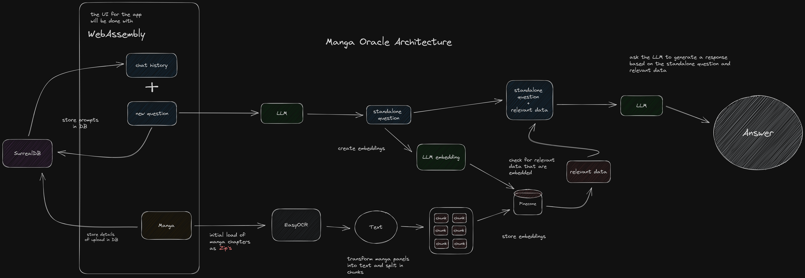

# Manga Oracle Overview
As a frequent manga reader I've come across into situations when a power/situation/event was described and later referenced in another chapter several months later. Or situations when something is explained but was hard to grasp, for example Hakari's domain expansion and cursed technique is hard to understand. 

This app is meant to work like a chatbot that you can feed with manga and will answer questions or explain things related to it.

The idea behind this project is to provide an educational experience in the development of AI powered applications and technologies I find interesting that I've been wanting to learn more about.

## Architecture


## Setup

```bash
# Commands to setup virtual environment
python -m venv venv

source venv/bin/activate

python -m pip install -r requirements.txt
```
## Roadmap

### Tasks to handle the core of the application
- Figure out how to use an LLM with OpenLLM and use the embedding functionality
- Figure out how Vectore Databases work and how to use Pinecone
- Figure out how to transform the output from EasyOCR into an embedding and store it in Pinecone
- Figure out the best way to group the resulting data of the manga panels from EasyOCR 
- Write a couple of functions to run all together, use a CLI first

### Tasks for presentation and web usage
- Figure out how WebAssembly works and how to use Python to write a Frontend app
- Figure out how to use SurrealDB and how to integrate it with Python
- Write Web Service for application
- Write functions to store messages, responses, and conversations with SurrealDB using Python
- Write functions to send zip files and process it with EasyOCR


## Useful Websites

- [OpenLLM](https://github.com/bentoml/OpenLLM)
- [Pinecone](https://www.pinecone.io/)
- [EasyOCR](https://github.com/JaidedAI/EasyOCR)
- [Flask](https://flask.palletsprojects.com/en/2.3.x/)
- [SurrealDB](https://surrealdb.com/)
- [WebAssembly](https://webassembly.org/)
